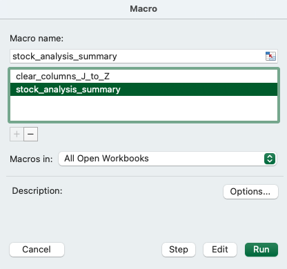
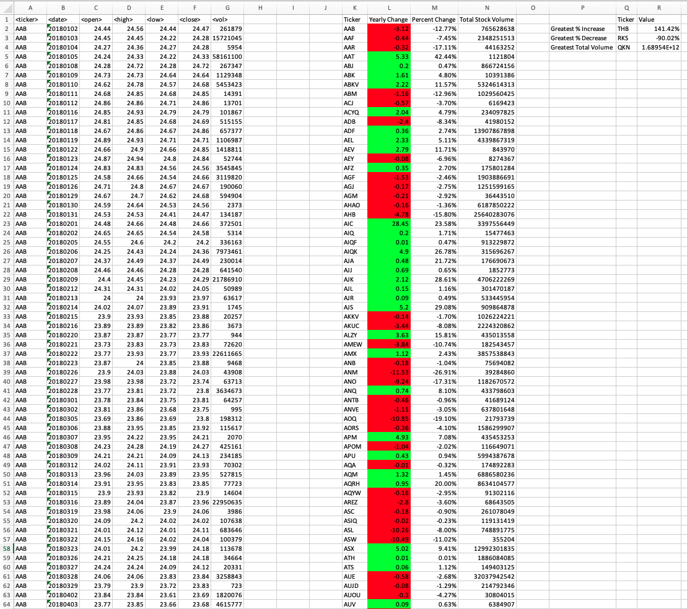
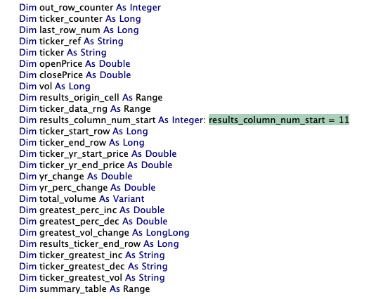

# stock-analysis

## Week 2 Homework: VBA Stock Analysis

## Description
This Bootcamp Exercise asks the students to write a VBA script that loops through all the stocks in a Microsoft Excel spreadsheet for one year and outputs the following information:
* The ticker symbol
* Yearly change from the opening price at the beginning of a given year to the closing price at the end of that year.
* The percentage change from the opening price at the beginning of a given year to the closing price at the end of that year.
* The total stock volume of the stock.

## Requirements
This VBA script requires that each sheet within the Excel Workbook has the stock information for a single calendar year and with the columns A to G populated with the following format:

## Installation
Please download and add to your macro-enabled spreadsheet the *stock_analsis.bas* script located in this repository. 

## Usage
This macro can be enabled and run by selecting Macro in the Excel Developers Tab. Please ensure that this feature is enabled in your Excel settings. Click and Run the *stock_analysis_summary* macro.

Please note that there is also a macro *clear_columns_J_to_Z* which can be run to clear the results after the macro is run.

The results table and summary table should look something like:

If the user wishes to control which column to start the yearly ticker summary, they may change this by editing the `results_column_num_start` variable.

## Support
Please email bjminwruck@gmail.com if the user has encountered any bugs or issues.

