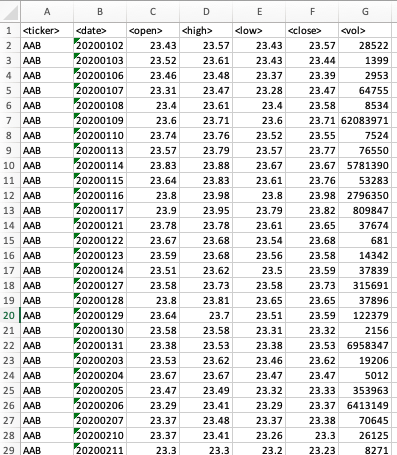

# stock-analysis

## Week 2 Homework: VBA Stock Analysis

## Description
This Bootcamp Exercise asks the students to write a VBA script that loops through all the stocks in a Microsoft Excel spreadsheet for one year and outputs the following information:
* The ticker symbol
* Yearly change from the opening price at the beginning of a given year to the closing price at the end of that year.
* The percentage change from the opening price at the beginning of a given year to the closing price at the end of that year.
* The total stock volume of the stock.

## Requirements
This VBA script requires that each sheet within the Excel Workbook has the stock information for a single calendar year and with the columns A to G populated with the following format:

## Installation
The Excel Spreadsheet should saved as a macro enabled .xlsm file extension with an attached VBA script. 

## Usage
This macro can be enabled and run by selecting Macro in the Excel Developers Tab. Please ensure that this tab is enabled in your Excel settings.

Use examples liberally, and show the expected output if you can. It's helpful to have inline the smallest example of usage that you can demonstrate, while providing links to more sophisticated examples if they are too long to reasonably include in the README.

## Support
Please email bjminwruck@gmail.com if the user has encountered any bugs or issues.

